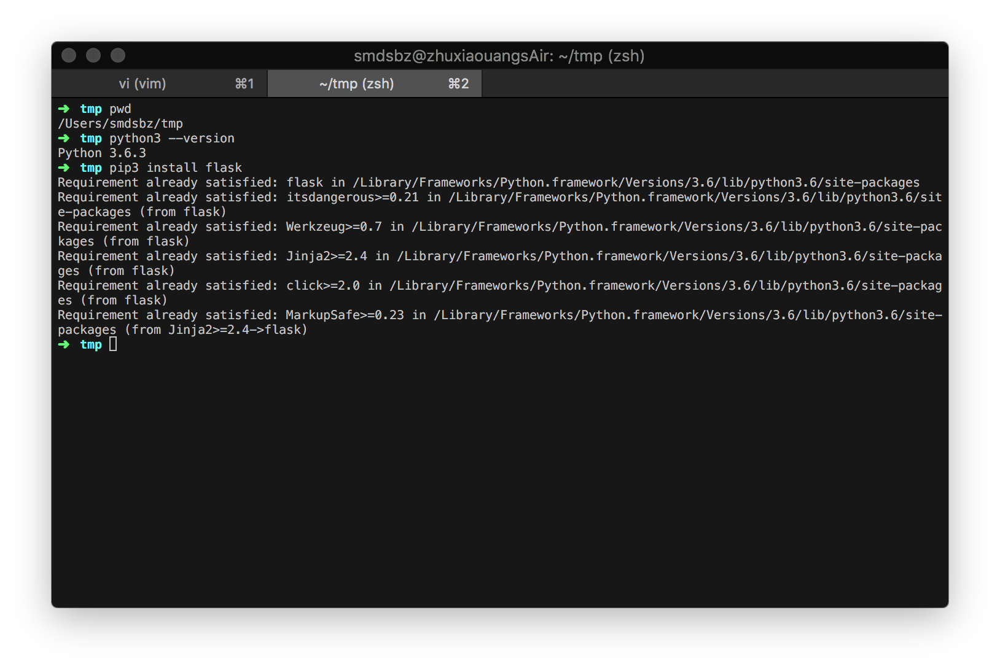
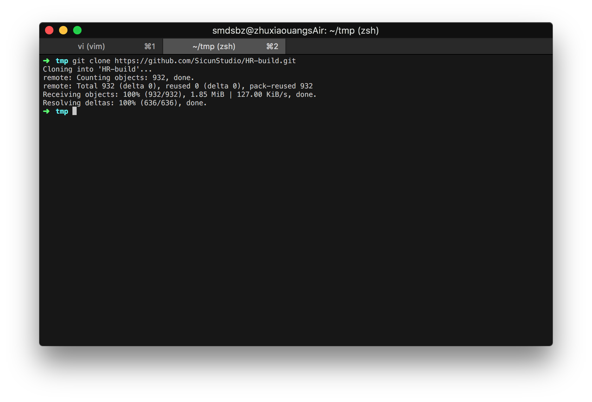
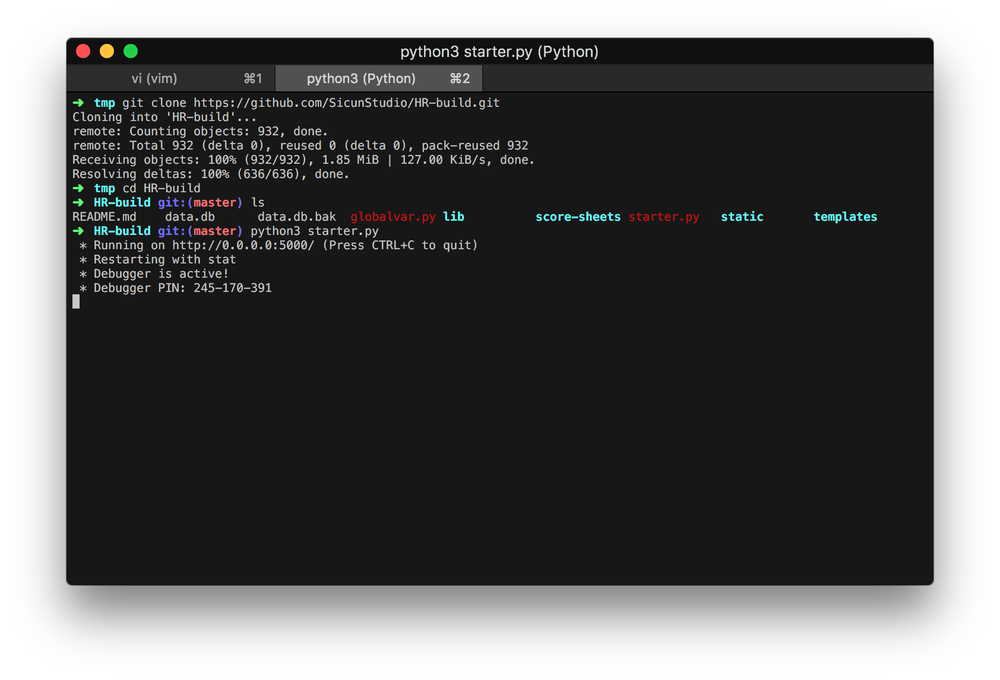
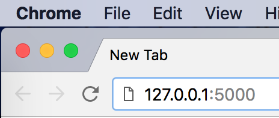
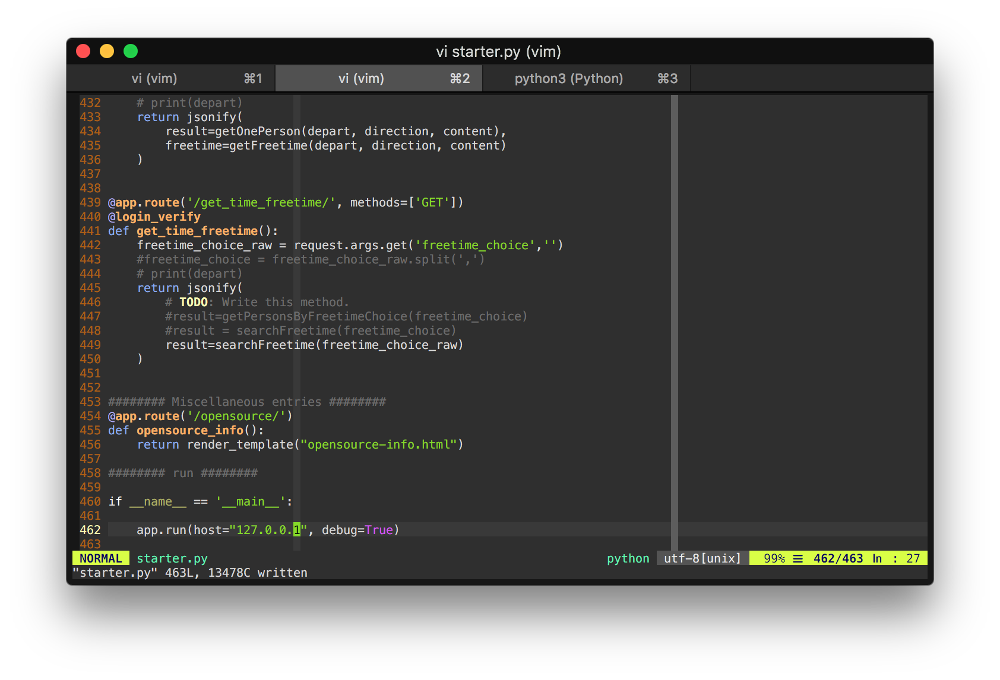
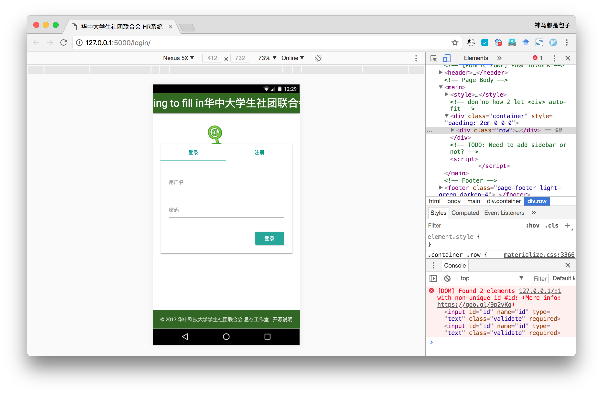
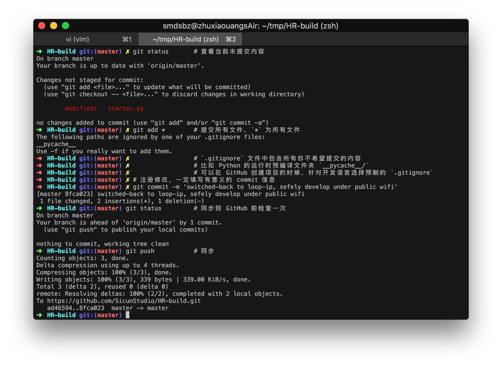

# LAB03

综合开发场景模拟

## 环境建立

1. 安装 Python3.6
2. 通过内建 pip 安装 flask 包

## GitHub 仓库同步至本地

## 试运行

**注意：**
- 使用 `python3 <main.py>` 运行程序，不要使用官网展示的通过 Flask script 运行的方式。
- 可以看到服务虽然挂载在 `0.0.0.0:5000` 上，即广播地址上运行，但是请在浏览器地址栏中显式指明访问 `127.0.0.1:5000`，即本地回环地址。开发过程中，除非测试需要，推荐使用本地回环地址。

## 作出修改

&emsp;&emsp;将端口地址改回本地。

&emsp;&emsp;此时服务在回环地址上运行，将不能通过在同一 WiFi 下的其它设备访问服务。  

&emsp;&emsp;之前是因为想看手机上的运行效果，所以调至广播地址，但实际上 Chrome 开发工具可以做同样的事（DevTool左上角第二个按钮）。开发时请一定考虑不同设备下的用户体验，如此时 navbar 上文字明显过多。  

## 提交修改

## 继续修改

**注意：**
- 切忌多人同时修改一份文件。
- 先 work ，再 work perfect ！提供解决方案是第一位的，完善解决方案具体实现、理解借鉴的代码是后话。

